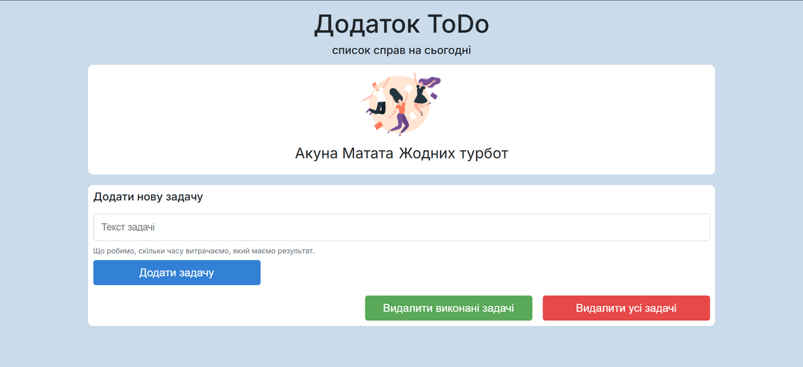

# ToDoList – Плануй свої справи кожного дня 🗓️✅🧠

🔗 **Демо:**  
[https://constantinekobushka.github.io/todo-list-js/](https://constantinekobushka.github.io/todo-list-js/)



## 🔎 Опис проєкту

**ToDoList** — це простий і водночас ефективний додаток для щоденного планування, який допоможе впорядкувати думки, поставити пріоритети та не забути жодної важливої справи.  
Сайт розроблений у стилі _desktop-first_ з гнучкою (гумовою) версткою, яка адаптується до будь-якої ширини екрана — від ноутбука до смартфона.

📝 Користувач може:

- Додати нову задачу ✍️
- Відзначити виконану ✅
- Видалити непотрібну 🗑️
- Очистити всі задачі одним кліком 🔄

Цей додаток стане надійним помічником для всіх, хто хоче бути продуктивним щодня — від школярів до фрилансерів і керівників.

Створено для тих, хто цінує **свій час**, **ясність у голові** та **щоденну продуктивність**.

---

## 🌟 Основний функціонал

- ➕ Додавання нових задач
- ✅ Відмічання виконаних задач
- 🗑️ Видалення окремих задач
- 🔄 Видалення всіх задач
- 💾 Збереження задач у Local Storage

---

## 🧰 Технологічний стек

### 🔨 Frontend

- **HTML5** – семантична та логічна розмітка
- **CSS3** – стилізація, гнучкий адаптивний дизайн
- **JavaScript** – взаємодія з DOM, динамічна логіка

---

## 🚀 Встановлення та запуск

### 📦 Клонування репозиторію:

```bash
git clone https://github.com/ConstantineKobushka/todo-list-js

Відкрийте папку проєкту у вашому редакторі коду (наприклад, VS Code)
та відкрийте файл index.html у браузері — і сайт готовий до перегляду.
```
